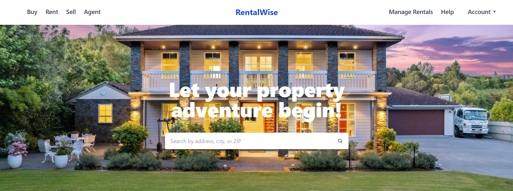
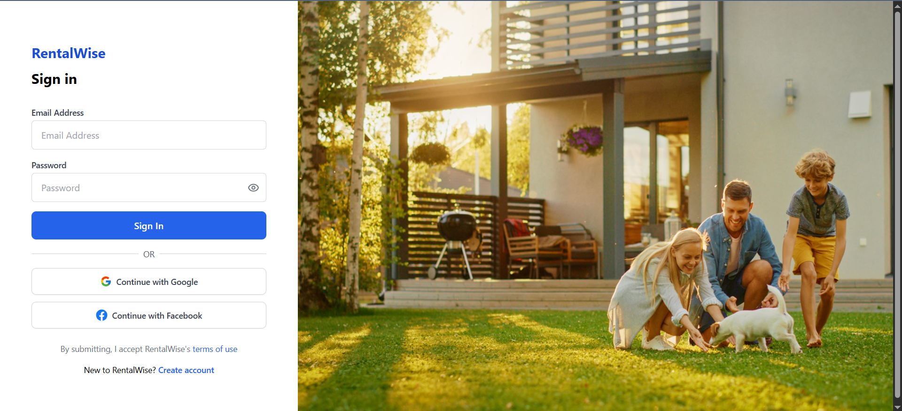
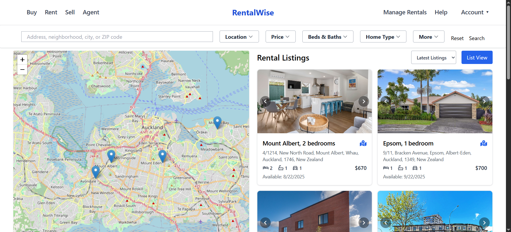
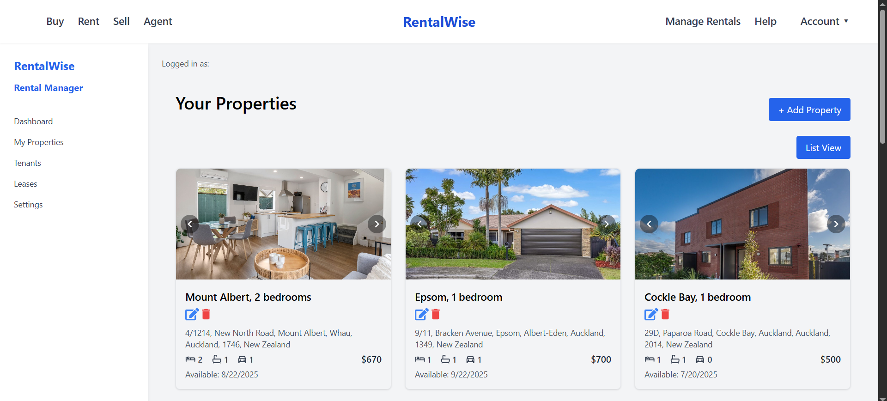
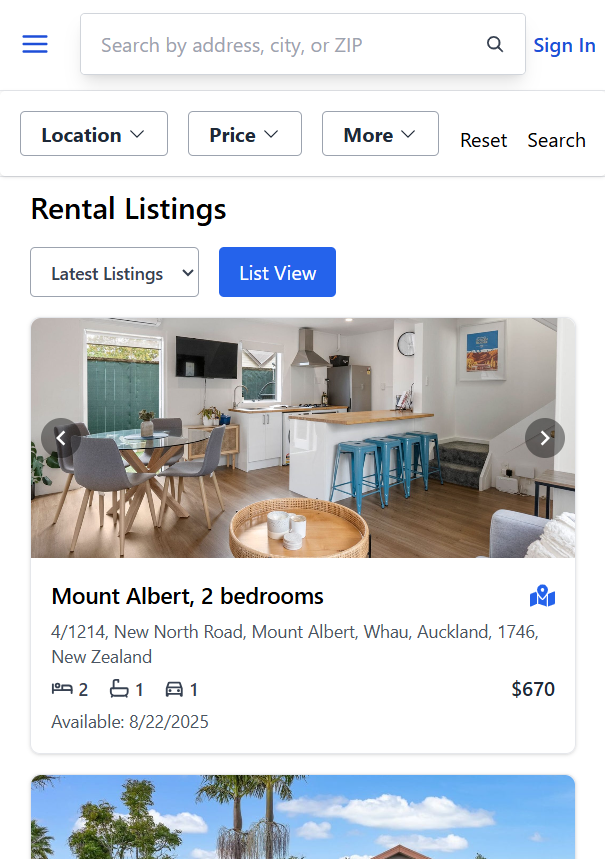

# 🏡 RentalWise

RentalWise is a modern, full-stack **property management web application** built with **ASP.NET Core** and **React**. It streamlines rental processes for **landlords** and **tenants**, offering features such as property listing, smart filters, secure logins, dashboards, and media galleries.

---

## 📌 Table of Contents

- [🚀 Features](#-features)
- [⚙️ Tech Stack](#️-tech-stack)
- [📷 Screenshots](#-screenshots)
- [📁 Project Structure](#-project-structure)
- [🚀 Getting Started](#-getting-started)
- [📦 API Endpoints](#-api-endpoints)
- [🧪 Testing](#-testing)
- [🗺 Roadmap](#-roadmap)
- [🙋‍♂️ Author](#-author)
- [📄 License](#-license)

---

## 🚀 Features

### 👩‍💼 Landlord Features
- Add, edit, and delete properties
- Upload property media (images/videos)
- Manage tenants and leases
- View properties in card or list view
- Zillow-style map interactions
- Filter/search properties

### 🧑‍💻 Tenant Features
- View available properties with filters
- Apply for rentals
- Dashboard to manage profile, payments (coming soon)

### 💻 Admin Features (Coming Soon)
- Manage users and content
- View system analytics

### 🌐 UI & UX
- Responsive UI (Mobile, Tablet, Desktop)
- Interactive filters and modals
- Clean navigation and role-based redirects

---

## ⚙️ Tech Stack

**Frontend**
- React.js
- TypeScript
- Tailwind CSS
- React Router
- Axios

**Backend**
- ASP.NET Core Web API
- Entity Framework Core
- ASP.NET Core Identity
- SQL Server 

**Testing**
- xUnit
- Moq
- EF Core InMemory
- React Testing Library (optional)

---

## 📷 Screenshots

<!-- Add your own screenshots here -->
Home


Auth


Property List


Landlord Dashboard


Mobile View


---

## 📁 Project Structure

```bash
RentalWise/
├── client/                      # React Frontend
│   ├── src/components/
│   ├── src/pages/
│   └── src/services/
│
├── server/                      # ASP.NET Core Backend (DDD structure)
│
│   ├── Api/                     # API Layer: Controllers, middleware, startup config
│   │   └── Controllers/
│
│   ├── Application/             # Application Layer: Use cases, DTOs, interfaces
│   │   └── Services/
│   │   └── Features/
│
│   ├── Domain/                  # Domain Layer: Entities, Value Objects, Interfaces, Enums
│   │   └── Entities/
│   │   └── ValueObjects/
│
│   ├── Infrastructure/          # Infrastructure Layer: EF Core DbContext, Repositories, Identity
│   │   └── Data/
│   │   └── Repositories/
│   │   └── Identity/
│
├── tests/                       # Automated Tests
│   ├── UnitTests/               # Unit tests for Application & Domain layers
│   ├── IntegrationTests/        # Integration tests using EF Core InMemory or SQLite
│   └── TestUtilities/           # Mocks, seed data, helpers

```

## 🚀 Getting Started

Backend (ASP.NET Core)
```
cd server
dotnet restore
dotnet ef database update
dotnet run
```
Frontend (React)
```
cd client
npm install
npm run dev
```
⚠️ Make sure to create .env files in both client/ and server/ directories to define environment variables like:
```
REACT_APP_API_BASE_URL
ConnectionStrings__DefaultConnection
```
## 📦 API Endpoints

🛡️ Auth
```
POST /api/auth/register/{role} – Register a new user (Landlord, Tenant, Admin)

POST /api/auth/login – Login and receive JWT token
```
👨‍💼 Landlord
```
POST /api/landlord – Create landlord profile

GET /api/landlord – Get current landlord

PUT /api/landlord – Update landlord details

DELETE /api/landlord – Delete landlord account
```
📍 Locations
```
GET /api/locations/regions – Get all regions

GET /api/locations/regions/{regionId}/districts – Get districts by region

GET /api/locations/districts/{districtId}/suburbs – Get suburbs by district

GET /api/locations/suburb/search – Search suburb by name
```
🏠 Properties
```
GET /api/properties – Get all properties (optional filters)

POST /api/properties – Add new property

GET /api/properties/{id} – Get property by ID

PUT /api/properties/{id} – Update property

DELETE /api/properties/{id} – Soft delete property

PUT /api/properties/restore/{id} – Restore deleted property

DELETE /api/properties/hard/{id} – Permanently delete property

POST /api/properties/search – Search/filter properties with criteria
```
👥 Tenants
```
POST /api/tenants – Create tenant profile

GET /api/tenants – Get current tenant

PUT /api/tenants – Update tenant details

DELETE /api/tenants – Delete tenant account
```

## 🧪 Testing

Run All Tests
```
cd tests
dotnet test
```

Technologies Used
- xUnit – Test framework for .NET
- Moq – Mocking services and interfaces
- EF Core InMemory – Lightweight provider for DB-less integration testing

## 🗺 Roadmap
 ✔Property CRUD

 ✔Landlord dashboard

 ✔Role-based authentication

 ✔Search & filter

 ✔Map integration

 Tenant application flow

  Payment integration

  Admin panel

  Email notifications

  Mobile-friendly enhancement
  
---

## 🙋‍♂️ Author

Nandu Gamitha

🔗 [](https://github.com/GamithaManawadu)

📝 [](https://medium.com/@gamithamanawadu26_76048)

💼 Aspiring Full-Stack Developer

---

## 📄 License
This project is licensed under the MIT License.
